# CS35L GroupHub

## Project Overview

CS35L GroupHub is a project management and communication web app designed for CS35L student project teams. The app helps students manage project work by providing tools for authentication, group viewing, task management, meeting coordination, and admin controls.

The goal of the app is to make team collaboration easier by keeping group information, tasks, and meeting-related tools in one place.

---

## Main Features

### Authentication and Security
- Users can sign up and log in.
- Passwords are hashed before being stored.
- The app uses JWT authentication.
- Protected pages require users to be logged in.
- Admin-only pages require admin privileges.

### User Dashboard
- Users are redirected to a dashboard after logging in.
- The dashboard acts as the main navigation hub.
- Users can access tasks, meetings, and group information from the dashboard.

### Group Management
- Users can view their assigned project group.
- Users can view current group members.
- Admin users can manage users and groups.

### Task Management
- Users can create tasks.
- Users can view personal and group tasks.
- Users can mark tasks as completed.
- Users can delete tasks.
- Users can search tasks by title or description.

### Meetings
- Users can access a meetings page for group scheduling and coordination.

### Admin Tools
- Admin users can access admin-only features.
- Admins can create users.
- Admins can create and manage project groups.
- Admins can search users by name or email.

### Messaging
- Users can send direct messages to other users.
- Users can participate in group conversations.
- Unread message notifications appear on the dashboard.
- Admins can access messages directly from the Admin Dashboard.

---

## Tech Stack

### Frontend
- React
- React Router
- JavaScript
- CSS

### Backend
- Node.js
- Express
- SQLite
- better-sqlite3
- bcryptjs
- JSON Web Tokens

---

## Setup
After cloning the repository, install dependencies for both the frontend and the backend.

### Install frontend dependencies
From the repository root:

```bash
npm install
```

### Install backend dependencies
```bash
cd server
npm install
cd ..
```

---

## Running the App Locally

### Start the backend
In one terminal:
```bash
cd server
node index.js
```

The backend runs at:
```text
http://localhost:5001
```
or whichever port is configured in `server/index.js`.

### Start the frontend
In another terminal, from the repository root:
```bash
npm start
```

The frontend runs at:
```text
http://localhost:3000
```

---

## Create an Admin Account
To create an admin account, run:
```bash
cd server
node seed-admin.js [email] [name] [password]
```

Example:
```bash
cd server
node seed-admin.js admin@example.com Admin password123
```
After creating the admin account, log in through the app using the admin email and password.

---

## User Flow
1. A user opens the welcome page.
2. The user chooses to log in or sign up.
3. After authentication, the user is redirected to the dashboard.
4. From the dashboard, the user can access:
   - Tasks
   - Meetings
   - Group information
   - Messages (unread messages show)
5. The tasks page allows users to create, complete, delete, and search tasks.
6. The group page displays the user's assigned group and group members.
7. Admin users can access admin tools to manage users and groups.
---
## Architecture Diagrams

### Class Diagram

This diagram illustrates the core data structures used within GroupHub and the relationships between them.
Users belong to groups, groups contain tasks and meetings, and users can exchange messages either directly or within a group.
The diagram highlights how the application's main entities interact to support collaboration, communication, task management, and meeting scheduling.

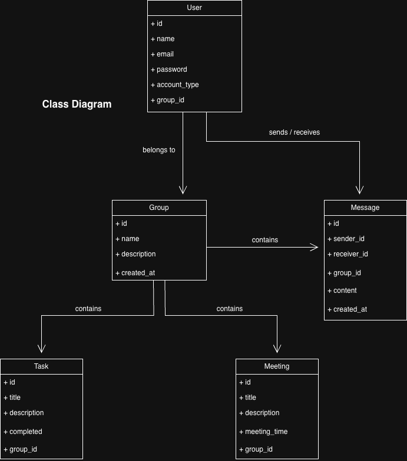

### System Architecture Diagram

This diagram illustrates the overall architecture of the application. 
The frontend is built using React and handles user interaction through pages such as login, tasks, meetings, and group management. 
The frontend communicates with the Express.js backend through API/HTTP requests. 
The backend processes authentication, task management, group management, and admin functionality before interacting with the SQLite database.

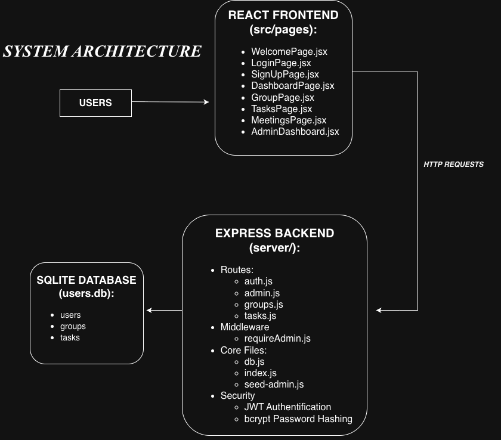

The backend uses JWT authentication and bcrypt password hashing to provide secure login and protected admin functionality.

---

### Messages Sequence Diagram

This sequence diagram demonstrates the call and responses between the user, the page, and the backend.
This includes initial page rendering, conversation creation, conversation loading, message sending, and polling for updates.

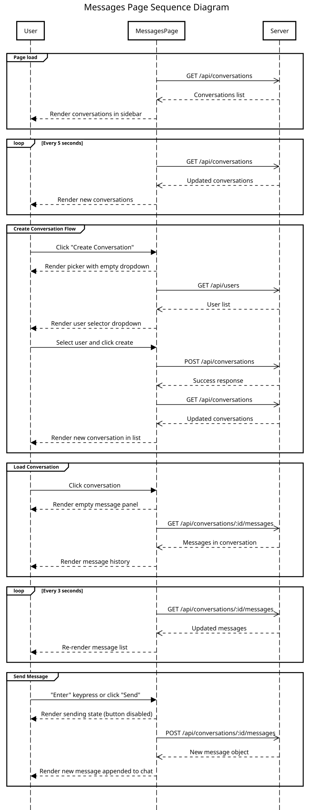

---

# Getting Started with Create React App

This project was bootstrapped with [Create React App](https://github.com/facebook/create-react-app).

## Available Scripts

In the project directory, you can run:

### `npm start`

Runs the app in the development mode.\
Open [http://localhost:3000](http://localhost:3000) to view it in your browser.

The page will reload when you make changes.\
You may also see any lint errors in the console.

### `npm test`

Launches the test runner in the interactive watch mode.\
See the section about [running tests](https://facebook.github.io/create-react-app/docs/running-tests) for more information.

### `npm run build`

Builds the app for production to the `build` folder.\
It correctly bundles React in production mode and optimizes the build for the best performance.

The build is minified and the filenames include the hashes.\
Your app is ready to be deployed!

See the section about [deployment](https://facebook.github.io/create-react-app/docs/deployment) for more information.

### `npm run eject`

**Note: this is a one-way operation. Once you `eject`, you can't go back!**

If you aren't satisfied with the build tool and configuration choices, you can `eject` at any time. This command will remove the single build dependency from your project.

Instead, it will copy all the configuration files and the transitive dependencies (webpack, Babel, ESLint, etc) right into your project so you have full control over them. All of the commands except `eject` will still work, but they will point to the copied scripts so you can tweak them. At this point you're on your own.

You don't have to ever use `eject`. The curated feature set is suitable for small and middle deployments, and you shouldn't feel obligated to use this feature. However we understand that this tool wouldn't be useful if you couldn't customize it when you are ready for it.

## Learn More

You can learn more in the [Create React App documentation](https://facebook.github.io/create-react-app/docs/getting-started).

To learn React, check out the [React documentation](https://reactjs.org/).

### Code Splitting

This section has moved here: [https://facebook.gthub.io/create-react-app/docs/code-splitting](https://facebook.github.io/create-react-app/docs/code-splitting)

### Analyzing the Bundle Size

This section has moved here: [https://facebook.github.io/create-react-app/docs/analyzing-the-bundle-size](https://facebook.github.io/create-react-app/docs/analyzing-the-bundle-size)

### Making a Progressive Web App

This section has moved here: [https://facebook.github.io/create-react-app/docs/making-a-progressive-web-app](https://facebook.github.io/create-react-app/docs/making-a-progressive-web-app)

### Advanced Configuration

This section has moved here: [https://facebook.github.io/create-react-app/docs/advanced-configuration](https://facebook.github.io/create-react-app/docs/advanced-configuration)

### Deployment

This section has moved here: [https://facebook.github.io/create-react-app/docs/deployment](https://facebook.github.io/create-react-app/docs/deployment)

### `npm run build` fails to minify

This section has moved here: [https://facebook.github.io/create-react-app/docs/troubleshooting#npm-run-build-fails-to-minify](https://facebook.github.io/create-react-app/docs/troubleshooting#npm-run-build-fails-to-minify)

---

# Current UI Preview

## Welcome Page

The landing page introduces the purpose of GroupHub and provides navigation to the Log In and Sign Up pages.

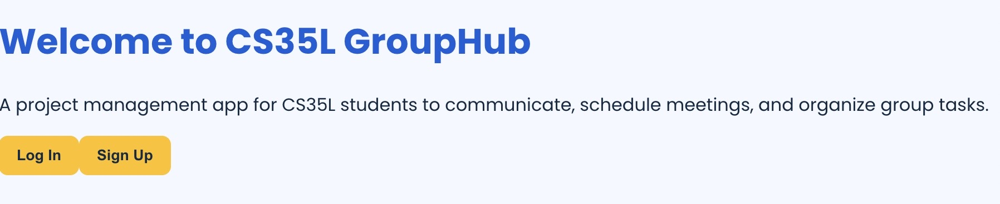

---

## Login Page

Users can log into their accounts using their email and password.

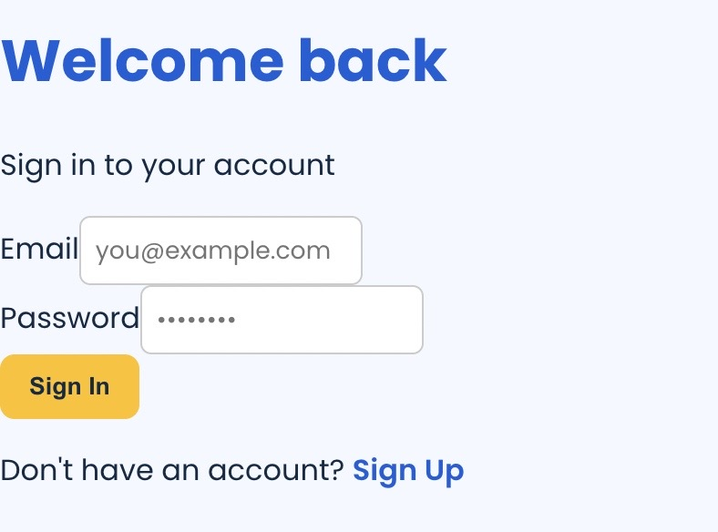

---

## Sign Up Page

New users can create an account by entering their name, email, and password.

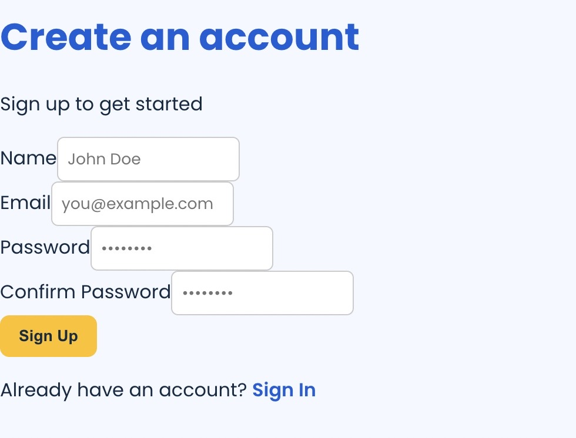

---

## Dashboard Page

The dashboard acts as the main navigation hub after login. Users can access:
- Tasks
- Meetings
- Group Information
- Personal Messages (unread messages notification count is directly displayed on the dashboard)

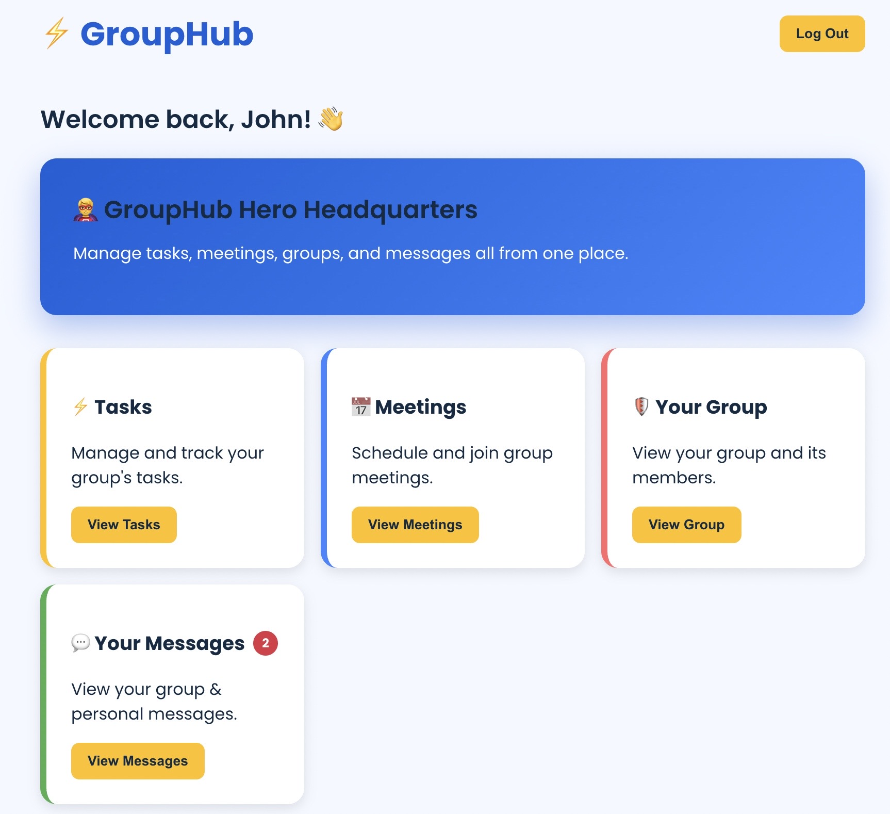

---

## Group Page

Users can view their assigned project group and current group members.

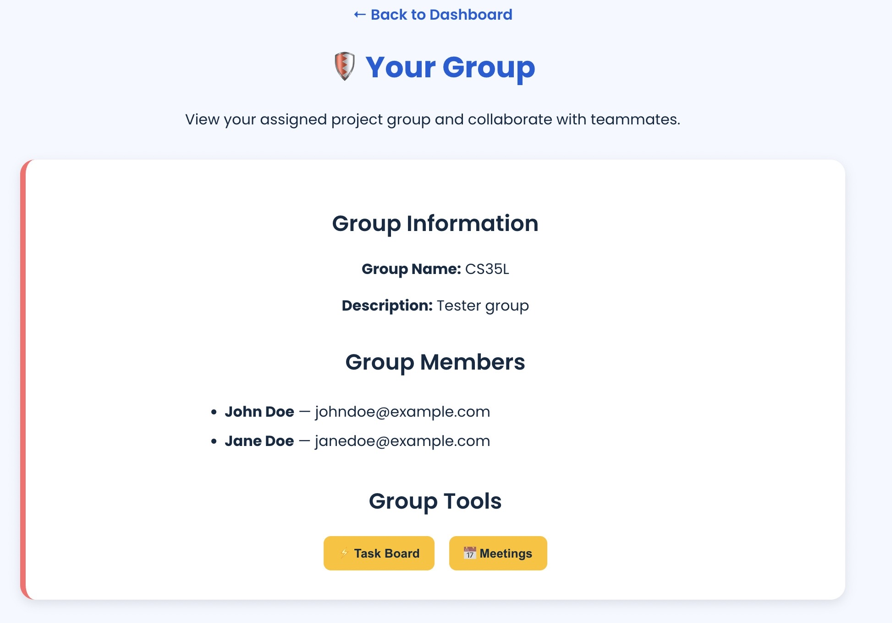

---

## Tasks Page

Users can create, complete, delete, and search for tasks.

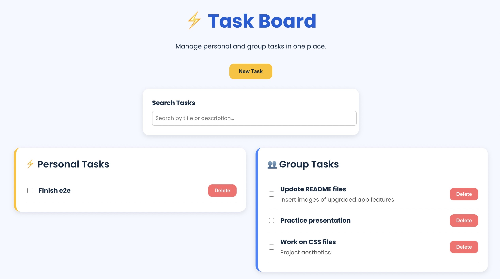

---

## Meetings Page

Users can coordinate and manage group meetings.

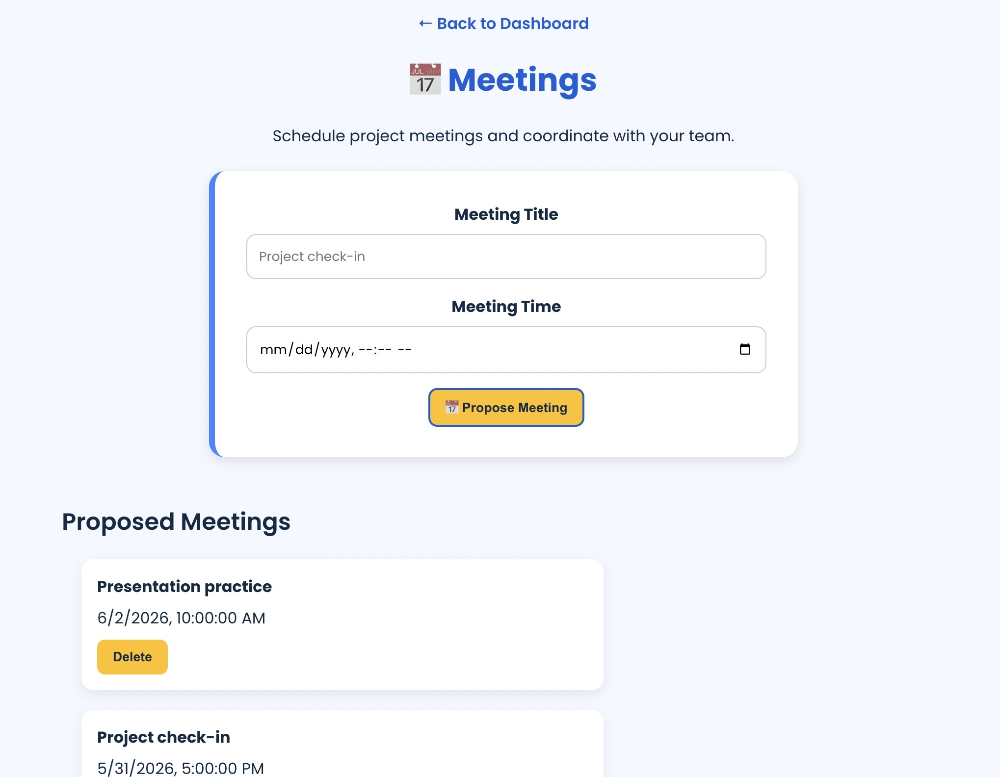

---

## Messages Page

Users can participate in direct and group conversations and receive unread message notifications.

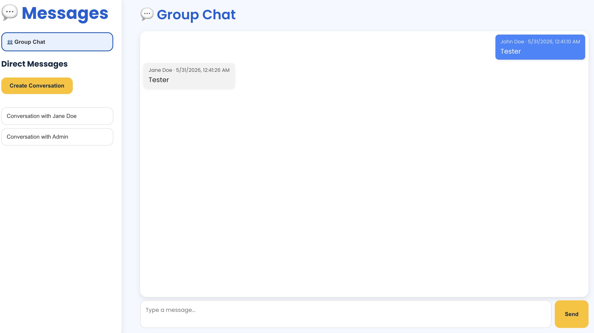
